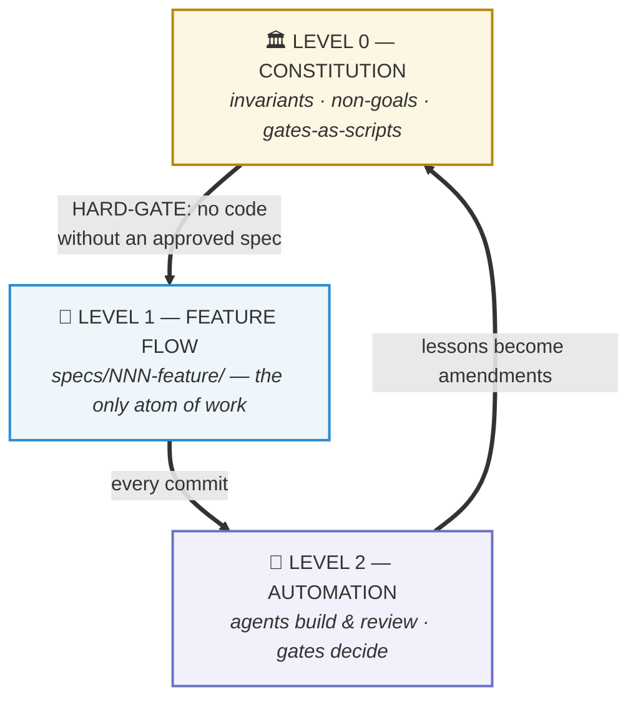
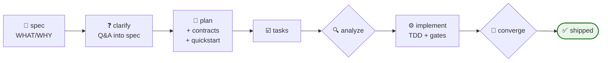

# 🏭 AI Factory Kit

**A complete, battle-tested operating system for AI-driven software development.**
Spec-first · executable gates · adversarial verification · one atom of work.

> Like [GitHub Spec Kit](https://github.com/github/spec-kit) — but it doesn't stop at specs.
> This kit is the **whole factory**: the constitution above the specs, the agents beside them,
> the gates below them, and the daily discipline that keeps all of it honest. Every rule in here
> was forged (and paid for) on a real production platform built ~100% by AI across 730+ commits.

**🇻🇳** *Bộ khung vận hành đầy đủ cho phát triển phần mềm bằng AI: spec trước code, cổng chạy được
thắng lời khai, review đối kháng, một nguyên tử công việc duy nhất. Mọi luật ở đây đều được tôi
luyện trên một platform production thật do AI viết ~100%.*

---

## Why this exists

Most "AI coding setups" die from the same five diseases:

| Disease | What it looks like | The cure in this kit |
|---|---|---|
| **The joint nobody wired** | Backend correct + frontend correct + *nobody wrote the connection* — and every gate stays green because each gate checks only ONE end | [`gates/GATES.md`](gates/GATES.md) — ask *"who will CALL this?"* + orphan-endpoint gates |
| **Docs drift from code** | The spec says 13, the code has 14; the plan says done, the map says ⬜ | [`model/SPEC-FLOW.md`](model/SPEC-FLOW.md) `analyze`/`converge` + self-globbing plan-sync gate |
| **The agent grades its own homework** | "I tested it, it works" — with an admin account that bypasses every ACL | Third-person acceptance law — [`gates/GATES.md`](gates/GATES.md) §3 |
| **Six vocabularies for work** | Epics, milestones, slices, waves, tickets, backlog items — all half-alive | ONE atom: `specs/NNN-feature/` — [`model/LEVELS.md`](model/LEVELS.md) |
| **Memory that lies** | A memory file frozen in June while the code shipped through September | Constitution governance + retro-fit discipline — [`model/RETROFIT-PLAYBOOK.md`](model/RETROFIT-PLAYBOOK.md) |

## The model at a glance

**Three levels.** The constitution rules everything; every feature is one directory; agents
verify but scripts decide.



**One feature, end to end** — the Level-1 loop ([full walkthrough](model/SPEC-FLOW.md)):



**Who does what** — the Level-2 roles ([definitions](harness/agents/)):

| 🕵️ [requirement-researcher](harness/agents/requirement-researcher.md) | 🎼 [task-orchestra](harness/agents/task-orchestra.md) | 🧪 [tester-e2e](harness/agents/tester-e2e.md) | 🧨 [tech-lead-review](harness/agents/tech-lead-review.md) |
|---|---|---|---|
| raw request → 80%-clean draft spec | file-disjoint dispatch, owns the merge | drives `quickstart.md` as a **non-privileged** user | adversarial multi-lens; findings fixed or refuted |

Three levels, one rule: **the spec directory `specs/NNN-<feature>/` is the only atom of work.**
Roadmaps are *views* over specs. Backlogs are *pointers* into specs. Nothing else holds content.

## Quickstart — for a human

```bash
cd your-project
git submodule add https://github.com/doxuta/ai-factory-kit factory   # or clone into factory/
cat factory/AI-ONBOARDING.md   # then hand your AI that file — it does the rest
```

The AI follows [`AI-ONBOARDING.md`](AI-ONBOARDING.md) §2: vendor at `factory/`, copy
`factory/harness/` → `.claude/` (+ the documented link fix-up), fill the constitution into
`.specify/memory/constitution.md`, install [Spec Kit](https://github.com/github/spec-kit)
(`uv tool install specify-cli && specify init --here --integration claude`), then run the first
feature with `/speckit-specify <what you want>`.

## Quickstart — for an AI

You are an AI agent connected to a project that uses this kit. **Read
[`AI-ONBOARDING.md`](AI-ONBOARDING.md) first** — it is written for you, tells you the exact
reading order, the invariants you must never break, and how every file here links to the others.

## What's inside

```
ai-factory-kit/
├── AI-ONBOARDING.md          ← an AI's entry point: read order + how to apply the kit
├── constitution/             ← Level 0: the invariant skeleton (7 principles, governance)
├── model/                    ← the 3-level model · spec flow · retro-fit playbook
├── harness/                  ← .claude/ skeleton: CLAUDE.md, rules, agents, portable skills
├── gates/                    ← executable definition-of-done + the plan-sync gate script
├── sync/                     ← how this kit stays current (daily-ship sync protocol)
└── examples/todo-api/        ← a worked example: constitution filled + one real spec cycle
```

Every file declares **who reads it and where it points** in a header block — the kit is a graph,
not a pile. Broken cross-links are treated as bugs.

## Lineage & license

Distilled from the Nexus platform factory (DOTB, 2026) — a metadata-driven multi-tenant engine
built spec-first by AI under human direction. Standing on: [github/spec-kit](https://github.com/github/spec-kit)
(MIT) · [obra/superpowers](https://github.com/obra/superpowers) (MIT) ·
[juliusbrussee/caveman](https://github.com/juliusbrussee/caveman) (MIT) ·
[DietrichGebert/ponytail](https://github.com/DietrichGebert/ponytail) (MIT) ·
[agentskills.io](https://agentskills.io) skill standard.

MIT — see [LICENSE](LICENSE). Kit updates flow in via the [daily-ship sync](sync/DAILY-SYNC.md);
see [CHANGELOG.md](CHANGELOG.md).
