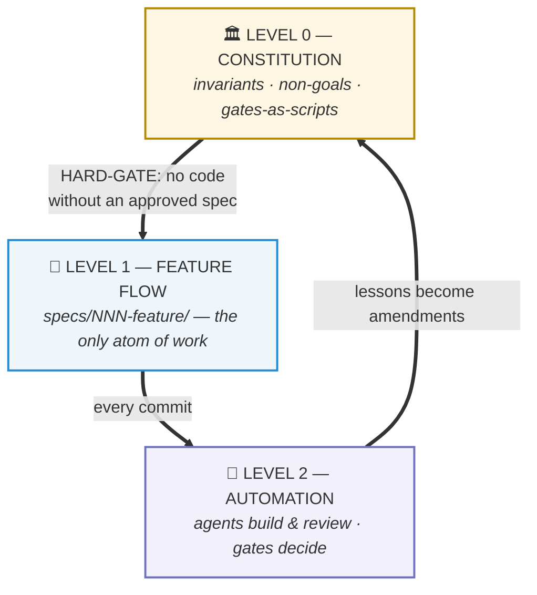
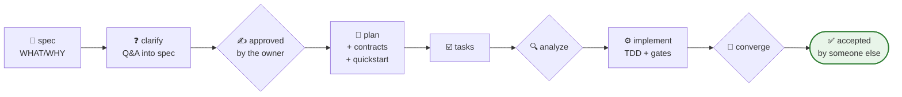

<!-- WHO READS ME: a human deciding whether to use this kit, and then installing it. An AI
     reads AI-ONBOARDING.md instead. I POINT TO: AI-ONBOARDING.md (the adoption procedure) ·
     model/PHASE-0.md (starting from an idea) · harness/HARNESS.md §7 (hosts and platforms) ·
     sync/DAILY-SYNC.md (staying current) · THIRD_PARTY_NOTICES.md (upstream credits).
     README.vi.md carries the same content in Vietnamese; change both together. -->

# 🏭 AI Factory Kit

**English** · [Tiếng Việt](README.vi.md)

**A complete, battle-tested operating system for AI-driven software development.**
Spec-first · executable gates · adversarial verification · one atom of work.

> Like [GitHub Spec Kit](https://github.com/github/spec-kit) — but it doesn't stop at specs.
> This kit is the **whole factory**: the constitution above the specs, the agents beside them,
> the gates below them, and the daily discipline that keeps all of it honest. Every rule in here
> was forged (and paid for) on a real production platform built ~100% by AI across 730+ commits.

**Supported.** Tested: Claude Code on Linux, macOS and WSL (project on the Linux filesystem).
Best-effort: native Windows, with Claude Code running hooks under Git Bash (without Git Bash
there is no guard). Other AI hosts
(Codex, Gemini CLI, Copilot, Cursor, …): the model, the specs, the Spec Kit flow and the gates
carry over; the harness (the `.claude/` layout, agents, rules) and the careful guard need
porting by hand. What differs per host and platform: [HARNESS §7](harness/HARNESS.md). For
1.4.0 every test suite passed on Linux under bash 5.2 with Python 3.11, and under bash 3.2.57
(the version macOS ships) with Python 3.8; no run on a Mac or a Windows host is recorded.
Version 1.4.0 ([VERSION](VERSION)), tested with Spec Kit (specify-cli) 1.0.12.

## Why this exists

Most "AI coding setups" die from the same five diseases:

| Disease | What it looks like | The cure in this kit |
|---|---|---|
| **The joint nobody wired** | Backend correct + frontend correct + *nobody wrote the connection* — and every gate stays green because each gate checks only ONE end | [`gates/GATES.md`](gates/GATES.md) — ask *"who will CALL this?"* + orphan-endpoint gates |
| **Docs drift from code** | The spec says 13, the code has 14; the plan says done, the map says ⬜ | [`model/SPEC-FLOW.md`](model/SPEC-FLOW.md) `analyze`/`converge` + self-globbing plan-sync gate |
| **The agent grades its own homework** | "I tested it, it works" — with an admin account that bypasses every ACL | Third-person acceptance law — [`gates/GATES.md`](gates/GATES.md) §3 |
| **Six vocabularies for work** | Epics, milestones, slices, waves, tickets, backlog items — all half-alive | ONE atom: `specs/NNN-feature/` — [`model/LEVELS.md`](model/LEVELS.md) |
| **Memory that lies** | A memory file frozen in June while the code shipped through September | Constitution governance + retro-fit discipline — [`model/RETROFIT-PLAYBOOK.md`](model/RETROFIT-PLAYBOOK.md) |

## The model at a glance

**Three levels.** The constitution rules everything; every feature is one directory; agents
verify but scripts decide.


```mermaid
flowchart TB
    L0["🏛️ LEVEL 0 — CONSTITUTION<br/><i>invariants · non-goals · gates-as-scripts</i>"]
    L1["🔁 LEVEL 1 — FEATURE FLOW<br/><i>specs/NNN-feature/ — the only atom of work</i>"]
    L2["🤖 LEVEL 2 — AUTOMATION<br/><i>agents build & review · gates decide</i>"]
    L0 ==>|"HARD-GATE: no code<br/>without an approved spec"| L1
    L1 ==>|"every commit"| L2
    L2 ==>|"lessons become amendments"| L0
    style L0 fill:#fdf6e3,stroke:#b58900,stroke-width:2px
    style L1 fill:#eef6fc,stroke:#268bd2,stroke-width:2px
    style L2 fill:#f2f0fa,stroke:#6c71c4,stroke-width:2px
```

**One feature, end to end** — the Level-1 loop ([full walkthrough](model/SPEC-FLOW.md)):


```mermaid
flowchart LR
    S["📄 spec<br/>WHAT/WHY"] --> C["❓ clarify<br/>Q&A into spec"] --> G{"✍️ approved<br/>by the owner"} --> P["📐 plan<br/>+ contracts<br/>+ quickstart"] --> T["☑️ tasks"]
    T --> A{"🔍 analyze"} --> I["⚙️ implement<br/>TDD + gates"] --> V{"🔄 converge"} --> D(["✅ accepted<br/>by someone else"])
    style D fill:#e8f5e9,stroke:#2e7d32,stroke-width:2px
```

**Who does what** — the Level-2 roles ([definitions](harness/agents/)):

| 🕵️ [requirement-researcher](harness/agents/requirement-researcher.md) | 🎼 [task-orchestra](harness/agents/task-orchestra.md) | 🧪 [tester-e2e](harness/agents/tester-e2e.md) | 🧨 [tech-lead-review](harness/agents/tech-lead-review.md) |
|---|---|---|---|
| raw request → 80%-clean draft spec | file-disjoint dispatch, owns the merge | runs `quickstart.md` through the real entry point, never the builder — as a **non-privileged** account where there is one | adversarial multi-lens; findings fixed or refuted |

Three levels, one rule: **the spec directory `specs/NNN-<feature>/` is the only atom of work.**
Roadmaps are *views* over specs. Backlogs are *pointers* into specs. Nothing else holds content.

## Quickstart — for a human

You need git, python3 (3.8 or later), bash, [uv](https://docs.astral.sh/uv/) and Claude Code.
Spec Kit, which uv installs, needs Python 3.11 or later.

```bash
mkdir my-product && cd my-product && git init -b main     # or cd into your existing repository
git submodule add https://github.com/doxuta/ai-factory-kit factory
git -C factory checkout v1.4.0 && git add .gitmodules factory
python3 factory/bin/adopt.py --profile full               # or backend, frontend, cli, library, …
uv tool install specify-cli==1.0.12
specify init --here --force --non-interactive --integration claude
```

Then start Claude Code in the project and say: *"Read factory/AI-ONBOARDING.md and set this
project up."* It interviews you for the vision, proposes the kind of product (the archetype) and
two or three stacks, and drafts the constitution for **your** approval. It then fills
`.claude/CLAUDE.md`, registers the careful guard and proves it fires, and builds feature 001: a
walking skeleton that wires the gate chain, the pre-commit hook and CI. What only you decide is
listed in [PHASE-0 §8](model/PHASE-0.md). The exact order, with what each step leaves behind, is
[`AI-ONBOARDING.md`](AI-ONBOARDING.md) §2.

- **Starting from an idea**, with no code yet: [`model/PHASE-0.md`](model/PHASE-0.md).
- **An existing project**: `adopt.py` merges into an existing `.claude/` and never overwrites a
  file — [AI-ONBOARDING §3](AI-ONBOARDING.md).
- **Not a submodule?** A plain copy of the kit in `factory/`, with no `.git` inside, also works.
  Not a plain `git clone` into `factory/`: git records it as an embedded repository, and every
  other clone of your project gets an empty `factory/` (`adopt.py` warns).
- **Teammates and CI** clone with `git clone --recurse-submodules`, or run
  `git submodule update --init` after cloning; an empty `factory/` leaves every link into it dead.
- **Staying current**: pin a tag, upgrade with `adopt.py --upgrade` —
  [`sync/DAILY-SYNC.md`](sync/DAILY-SYNC.md).

## Quickstart — for an AI

You are an AI agent connected to a project that uses this kit. **Read
[`AI-ONBOARDING.md`](AI-ONBOARDING.md) first** — it is written for you, tells you the exact
reading order, the invariants you must never break, and how every file here links to the others.

## Using it day-to-day

The full command table (what each `/speckit-*` command writes, when to run it, which agent and
skill plug in where) lives in [`model/SPEC-FLOW.md`](model/SPEC-FLOW.md) — the kit's equivalent
of Spec Kit's command reference, extended with the roles and gates around each step. Work that
is not a feature — a bug, a hotfix, a refactor, a spike, a release — has its lane in
[`model/NON-FEATURE-WORK.md`](model/NON-FEATURE-WORK.md). "Done" is `./gates/run-chain.sh`
green. The kit ships the spec gates behind three of its slots (doc-sync, spec-approval,
spec-numbers) and a configurable reference for a fourth (orphan-endpoints); format, static,
test, build and acceptance are your stack's commands, and they stay red — "not wired" — until
feature 001 wires them ([GATES §1](gates/GATES.md)).

## What's inside

```
ai-factory-kit/
├── AI-ONBOARDING.md          ← an AI's entry point: read order + how to apply the kit
├── bin/                      ← adopt.py (install · merge · upgrade · audit) · link check · metrics
├── constitution/             ← Level 0: the constitution template (7 articles) + vision template
├── model/                    ← 3 levels · spec flow · Phase 0 · archetypes · lanes · retro-fit
├── harness/                  ← .claude/ skeleton: CLAUDE.md, rules, agents, skills, careful guard
├── gates/                    ← executable definition of done: chain runner + spec and sync gates
├── speckit/                  ← Spec Kit template overrides (spec, tasks), installed by adopt.py
├── sync/                     ← how this kit stays current, and how an adopter does
├── examples/todo-api/        ← worked example: multi-tenant web app, skeleton accepted + a feature mid-flight
├── examples/budget-cli/      ← worked example: single-user CLI, one feature accepted end to end
├── VERSION                   ← the kit release (1.4.0)
└── THIRD_PARTY_NOTICES.md    ← what was adapted from which MIT project, with their notices
```

Every doc under `constitution/`, `model/`, `harness/`, `gates/`, `speckit/`, `sync/` and
`examples/` opens with a header comment saying **who reads it and where it points** — right
after the YAML frontmatter in the files that must open with one (agents, rules, skills, specs,
the spec template) — the kit is a graph, not a pile. Broken cross-links are bugs: CI runs `python3 bin/check-links.py .` on every push.

## Lineage & license

Distilled from the Nexus platform factory (DOTB, 2026) — a metadata-driven multi-tenant engine
built spec-first by AI under human direction. Standing on:
[github/spec-kit](https://github.com/github/spec-kit) (MIT — the command flow, and the spec and
tasks templates adapted in [`speckit/overrides/`](speckit/overrides/)) ·
[obra/superpowers](https://github.com/obra/superpowers) (MIT — spec-first, plan-and-tdd) ·
[juliusbrussee/caveman](https://github.com/juliusbrussee/caveman) (MIT — its skill) ·
[DietrichGebert/ponytail](https://github.com/DietrichGebert/ponytail) (MIT) ·
[garrytan/gstack](https://github.com/garrytan/gstack) (MIT — the `careful` guard's matcher
logic and its two-tier design) · the [agentskills.io](https://agentskills.io) skill format.
Their copyright and permission notices, and exactly what came from each:
[THIRD_PARTY_NOTICES.md](THIRD_PARTY_NOTICES.md).

MIT — see [LICENSE](LICENSE). Kit updates flow in via the [daily-ship sync](sync/DAILY-SYNC.md);
see [CHANGELOG.md](CHANGELOG.md).
