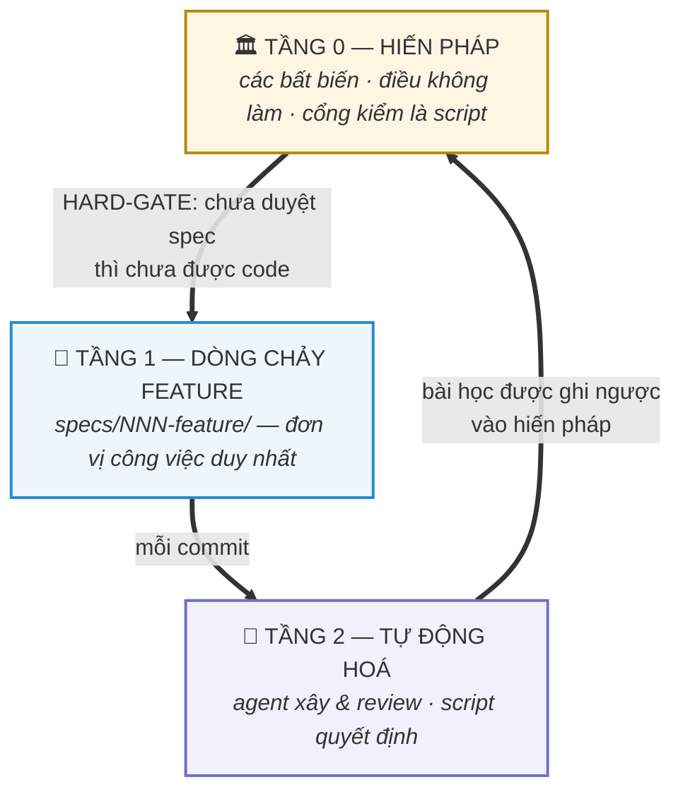
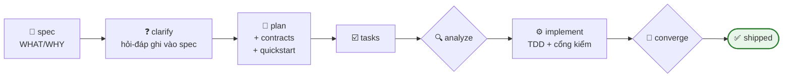

# 🏭 AI Factory Kit

[English](README.md) · **Tiếng Việt**

**Bộ khung vận hành hoàn chỉnh cho phát triển phần mềm bằng AI — đã kiểm chứng qua production.**
Spec trước code · cổng kiểm chạy được · review đối kháng · một đơn vị công việc duy nhất.

> Giống [GitHub Spec Kit](https://github.com/github/spec-kit) — nhưng không dừng lại ở spec.
> Kit này là **cả nhà máy**: hiến pháp đứng trên spec, agent làm việc quanh spec, cổng kiểm chặn
> dưới spec, và kỷ luật hằng ngày giữ cho tất cả trung thực. Mọi luật trong này đều rút ra từ
> kinh nghiệm thật (kèm học phí thật) trên một nền tảng production do AI viết ~100% qua hơn
> 730 commit.

---

## Vì sao có kit này

Đa số setup "AI coding" chết vì đúng 5 căn bệnh:

| Bệnh | Triệu chứng | Thuốc trong kit |
|---|---|---|
| **Đoạn nối không ai viết** | Backend đúng + frontend đúng + *không ai viết đoạn nối ở giữa* — mà mọi cổng kiểm vẫn xanh, vì mỗi cổng chỉ kiểm MỘT đầu | [`gates/GATES.md`](gates/GATES.md) — luôn hỏi *"ai sẽ GỌI cái này?"* + cổng bắt endpoint mồ côi |
| **Tài liệu trôi khỏi code** | Spec ghi 13, code có 14; plan báo xong, bản đồ tổng vẫn để trống | `analyze`/`converge` + cổng plan-sync tự dò file — [`model/SPEC-FLOW.md`](model/SPEC-FLOW.md) |
| **Agent tự chấm bài của mình** | "Tôi thử rồi, chạy tốt" — nhưng thử bằng tài khoản admin vốn bỏ qua mọi phân quyền | Luật nghiệm thu bằng người-thứ-ba — [`gates/GATES.md`](gates/GATES.md) §3 |
| **Sáu kiểu gọi tên công việc** | Epic, milestone, lát, wave, ticket, backlog — kiểu nào cũng sống dở chết dở | MỘT đơn vị duy nhất: `specs/NNN-feature/` — [`model/LEVELS.md`](model/LEVELS.md) |
| **Bộ nhớ nói dối** | File memory đứng yên ở tháng 6 trong khi code đã ship tới tháng 9 | Cơ chế tu chính hiến pháp + kỷ luật retro-fit — [`model/RETROFIT-PLAYBOOK.md`](model/RETROFIT-PLAYBOOK.md) |

## Toàn cảnh mô hình

**Ba tầng.** Hiến pháp đứng trên tất cả; mỗi feature là một thư mục; agent xây và kiểm, nhưng
script mới là thứ quyết định "xong".



**Một feature từ đầu tới cuối** — vòng lặp Tầng 1 ([hướng dẫn từng bước](model/SPEC-FLOW.md)):



**Ai làm việc gì** — bốn vai ở Tầng 2 ([định nghĩa đầy đủ](harness/agents/)):

| 🕵️ [requirement-researcher](harness/agents/requirement-researcher.md) | 🎼 [task-orchestra](harness/agents/task-orchestra.md) | 🧪 [tester-e2e](harness/agents/tester-e2e.md) | 🧨 [tech-lead-review](harness/agents/tech-lead-review.md) |
|---|---|---|---|
| yêu cầu thô → bản nháp spec sạch ~80% | chia việc không giẫm chân nhau, tự tay merge | chạy `quickstart.md` bằng tài khoản **thường, không đặc quyền** | review đối kháng nhiều góc nhìn; finding phải được sửa hoặc bác có căn cứ |

## Bắt đầu nhanh — dành cho bạn

```bash
cd du-an-cua-ban
git submodule add https://github.com/doxuta/ai-factory-kit factory   # hoặc clone vào factory/
cat factory/AI-ONBOARDING.md   # rồi đưa file đó cho AI của bạn — nó tự lo phần còn lại
```

AI sẽ làm theo [`AI-ONBOARDING.md`](AI-ONBOARDING.md) §2: đặt kit tại `factory/`, copy
`factory/harness/` → `.claude/` (kèm bước sửa link đã ghi sẵn), điền hiến pháp vào
`.specify/memory/constitution.md`, cài [Spec Kit](https://github.com/github/spec-kit)
(`uv tool install specify-cli && specify init --here --integration claude`), rồi chạy feature
đầu tiên: `/speckit-specify <mô tả điều bạn muốn>`.

## Bắt đầu nhanh — dành cho AI

Bạn là một AI agent được nối vào dự án dùng kit này. **Hãy đọc
[`AI-ONBOARDING.md`](AI-ONBOARDING.md) trước tiên** — file đó viết riêng cho bạn: thứ tự đọc,
những bất biến không bao giờ được phá, và cách mọi file trong kit liên kết với nhau.

## Dùng hằng ngày

Bảng tra cứu lệnh đầy đủ (mỗi lệnh `/speckit-*` sinh ra file gì, chạy vào lúc nào, agent và
skill nào tham gia ở bước đó) nằm trong [`model/SPEC-FLOW.md`](model/SPEC-FLOW.md) — tương đương
bảng lệnh của Spec Kit, nhưng gắn thêm vai trò và cổng kiểm quanh từng bước.

## Bên trong có gì

```
ai-factory-kit/
├── AI-ONBOARDING.md          ← cửa vào dành cho AI: thứ tự đọc + cách áp dụng kit
├── constitution/             ← Tầng 0: khung hiến pháp (7 điều + cơ chế tu chính)
├── model/                    ← mô hình 3 tầng · dòng chảy spec · playbook retro-fit
├── harness/                  ← khung .claude/: CLAUDE.md, rules, agents, skills dùng lại được
├── gates/                    ← definition-of-done dạng script + cổng plan-sync
├── sync/                     ← cách kit luôn được cập nhật (giao thức daily-ship sync)
└── examples/todo-api/        ← ví dụ trọn vẹn: hiến pháp đã điền + một chu trình spec thật
```

Mỗi file đều khai ngay ở header **ai đọc nó và nó trỏ tới đâu** — kit là một đồ thị có chủ đích,
không phải một đống file. Link gãy được coi là bug.

## Nguồn gốc & giấy phép

Đúc kết từ nhà máy phần mềm Nexus (DOTB, 2026) — một engine metadata-driven đa tổ chức, xây
theo lối spec-first bằng AI dưới sự chỉ huy của con người. Kế thừa:
[github/spec-kit](https://github.com/github/spec-kit) (MIT) ·
[obra/superpowers](https://github.com/obra/superpowers) (MIT) ·
[juliusbrussee/caveman](https://github.com/juliusbrussee/caveman) (MIT) ·
[DietrichGebert/ponytail](https://github.com/DietrichGebert/ponytail) (MIT) ·
[garrytan/gstack](https://github.com/garrytan/gstack) (MIT — logic so khớp và thiết kế hai tầng
của guard `careful`) · chuẩn skill [agentskills.io](https://agentskills.io).

Giấy phép MIT — xem [LICENSE](LICENSE). Kit được cập nhật qua
[daily-ship sync](sync/DAILY-SYNC.md); lịch sử thay đổi: [CHANGELOG.md](CHANGELOG.md).
