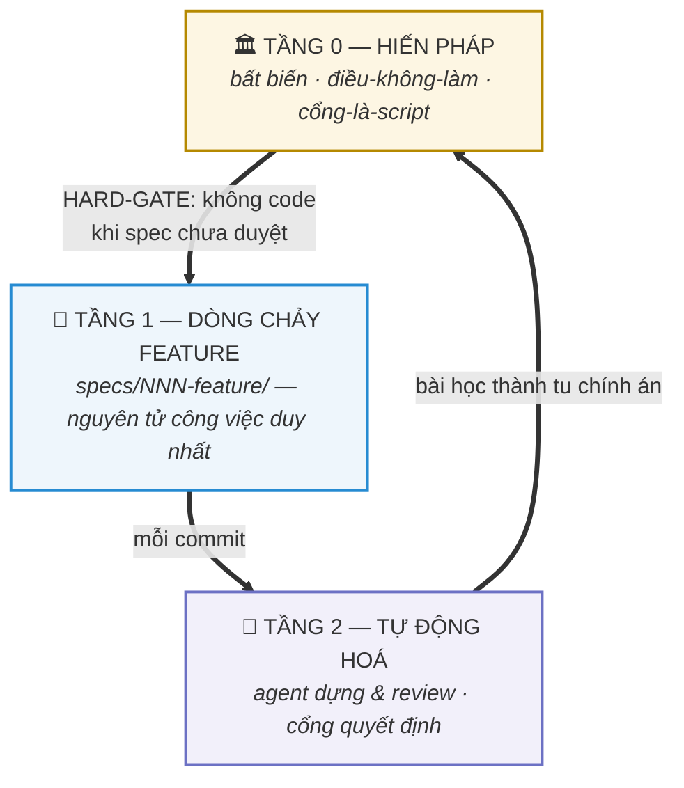
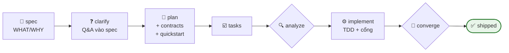

# 🏭 AI Factory Kit

[English](README.md) · **Tiếng Việt**

**Hệ điều hành hoàn chỉnh, đã tôi luyện qua production, cho phát triển phần mềm bằng AI.**
Spec trước code · cổng chạy được · review đối kháng · một nguyên tử công việc.

> Giống [GitHub Spec Kit](https://github.com/github/spec-kit) — nhưng không dừng ở spec.
> Kit này là **cả nhà máy**: hiến pháp đứng trên spec, agent đứng cạnh spec, cổng đứng dưới spec,
> và kỷ luật hằng ngày giữ tất cả trung thực. Mọi luật ở đây đều được trả giá trên một platform
> production thật do AI viết ~100% qua 730+ commit.

---

## Vì sao kit này tồn tại

Đa số setup "AI coding" chết vì đúng 5 căn bệnh:

| Bệnh | Triệu chứng | Thuốc trong kit |
|---|---|---|
| **Đoạn nối không ai viết** | BE đúng + FE đúng + *không ai viết đoạn nối* — mọi cổng vẫn xanh vì mỗi cổng chỉ kiểm MỘT đầu | [`gates/GATES.md`](gates/GATES.md) — hỏi *"ai sẽ GỌI nó?"* + cổng orphan-endpoint |
| **Docs trôi khỏi code** | Spec nói 13, code có 14; plan nói xong, bản đồ còn ⬜ | `analyze`/`converge` + cổng plan-sync tự-glob — [`model/SPEC-FLOW.md`](model/SPEC-FLOW.md) |
| **Agent tự chấm bài mình** | "Tôi thử rồi, chạy tốt" — bằng tài khoản admin bypass mọi ACL | Luật nghiệm thu người-thứ-ba — [`gates/GATES.md`](gates/GATES.md) §3 |
| **Sáu bộ từ vựng cho công việc** | Epic, milestone, lát, wave, ticket, backlog — cái nào cũng sống dở | MỘT nguyên tử: `specs/NNN-feature/` — [`model/LEVELS.md`](model/LEVELS.md) |
| **Bộ nhớ nói dối** | File memory đứng ở tháng 6 trong khi code ship tới tháng 9 | Governance hiến pháp + kỷ luật retro-fit — [`model/RETROFIT-PLAYBOOK.md`](model/RETROFIT-PLAYBOOK.md) |

## Mô hình trong một cái nhìn

**Ba tầng.** Hiến pháp đứng trên tất cả; mỗi feature là một thư mục; agent kiểm chứng nhưng
script quyết định.



**Một feature, đầu-tới-cuối** — vòng lặp Tầng 1 ([đi từng bước](model/SPEC-FLOW.md)):



**Ai làm gì** — bốn vai Tầng 2 ([định nghĩa](harness/agents/)):

| 🕵️ [requirement-researcher](harness/agents/requirement-researcher.md) | 🎼 [task-orchestra](harness/agents/task-orchestra.md) | 🧪 [tester-e2e](harness/agents/tester-e2e.md) | 🧨 [tech-lead-review](harness/agents/tech-lead-review.md) |
|---|---|---|---|
| requirement thô → bản nháp spec sạch 80% | chia việc file-disjoint, sở hữu khâu merge | chạy `quickstart.md` bằng tài khoản **không-đặc-quyền** | review đối kháng đa lăng kính; finding phải sửa hoặc bác |

## Bắt đầu nhanh — cho người

```bash
cd du-an-cua-ban
git submodule add https://github.com/doxuta/ai-factory-kit factory   # hoặc clone vào factory/
cat factory/AI-ONBOARDING.md   # rồi đưa file đó cho AI của bạn — nó tự làm phần còn lại
```

AI sẽ theo [`AI-ONBOARDING.md`](AI-ONBOARDING.md) §2: vendor kit tại `factory/`, copy
`factory/harness/` → `.claude/` (+ bước sửa link đã ghi sẵn), điền hiến pháp vào
`.specify/memory/constitution.md`, cài [Spec Kit](https://github.com/github/spec-kit)
(`uv tool install specify-cli && specify init --here --integration claude`), rồi chạy feature
đầu tiên bằng `/speckit-specify <bạn muốn gì>`.

## Bắt đầu nhanh — cho AI

Bạn là một AI agent được nối vào dự án dùng kit này. **Đọc
[`AI-ONBOARDING.md`](AI-ONBOARDING.md) trước** — file đó viết cho chính bạn: thứ tự đọc, những
bất biến không bao giờ được phá, và cách mọi file ở đây liên kết với nhau.

## Dùng hằng ngày

Bảng lệnh đầy đủ (mỗi lệnh `/speckit-*` ghi file gì, chạy lúc nào, agent và skill nào cắm vào
đâu) nằm ở [`model/SPEC-FLOW.md`](model/SPEC-FLOW.md) — tương đương bảng lệnh của Spec Kit,
mở rộng thêm vai trò và cổng quanh từng bước.

## Bên trong có gì

```
ai-factory-kit/
├── AI-ONBOARDING.md          ← cửa vào của AI: thứ tự đọc + cách áp dụng kit
├── constitution/             ← Tầng 0: khung bất biến (7 điều, governance)
├── model/                    ← mô hình 3 tầng · dòng chảy spec · playbook retro-fit
├── harness/                  ← khung .claude/: CLAUDE.md, rules, agents, skills portable
├── gates/                    ← definition-of-done chạy được + script cổng plan-sync
├── sync/                     ← cách kit luôn mới (giao thức daily-ship sync)
└── examples/todo-api/        ← ví dụ trọn vẹn: hiến pháp đã điền + một chu trình spec thật
```

Mỗi file khai **ai đọc nó và nó trỏ đi đâu** ngay header — kit là một đồ thị, không phải một
đống file. Link gãy được coi là bug.

## Nguồn gốc & giấy phép

Chưng cất từ nhà máy Nexus (DOTB, 2026) — engine metadata-driven đa tổ chức, dựng spec-first
bằng AI dưới sự chỉ huy của con người. Đứng trên vai: [github/spec-kit](https://github.com/github/spec-kit)
(MIT) · [obra/superpowers](https://github.com/obra/superpowers) (MIT) ·
[juliusbrussee/caveman](https://github.com/juliusbrussee/caveman) (MIT) ·
[DietrichGebert/ponytail](https://github.com/DietrichGebert/ponytail) (MIT) ·
chuẩn skill [agentskills.io](https://agentskills.io).

MIT — xem [LICENSE](LICENSE). Kit cập nhật qua [daily-ship sync](sync/DAILY-SYNC.md);
xem [CHANGELOG.md](CHANGELOG.md).
