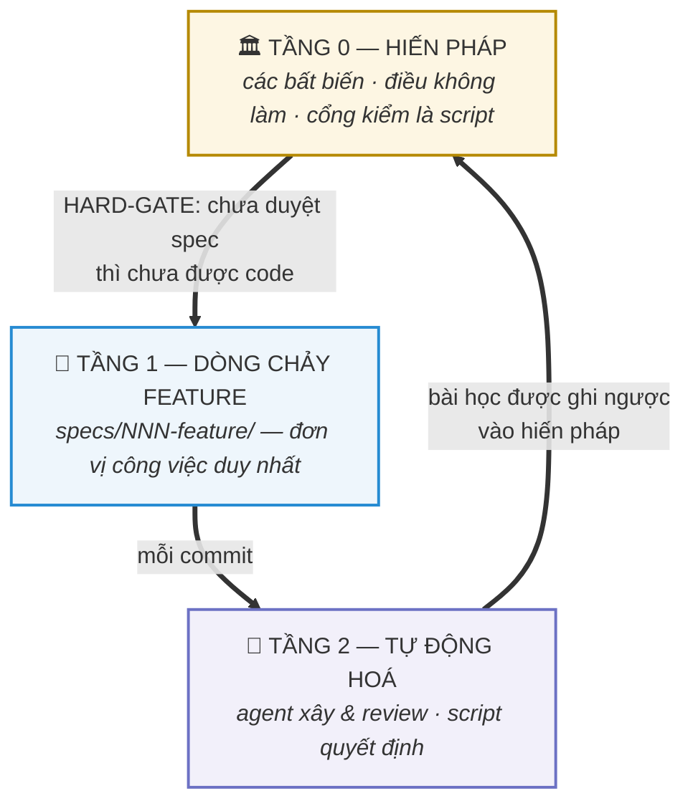
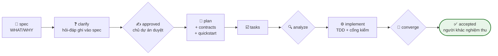

<!-- WHO READS ME: người đọc tiếng Việt đang cân nhắc có dùng kit này không, rồi cài nó. AI thì
     đọc AI-ONBOARDING.md. I POINT TO: AI-ONBOARDING.md (quy trình áp dụng) · model/PHASE-0.md
     (bắt đầu từ ý tưởng) · harness/HARNESS.md §7 (host và nền tảng) · sync/DAILY-SYNC.md (cập
     nhật) · THIRD_PARTY_NOTICES.md. Bản song sinh tiếng Việt của README.md: cùng nội dung, sửa
     bản này thì sửa luôn bản kia. -->

# 🏭 AI Factory Kit

[English](README.md) · **Tiếng Việt**

**Bộ khung vận hành hoàn chỉnh cho phát triển phần mềm bằng AI — đã kiểm chứng qua production.**
Spec trước code · cổng kiểm chạy được · review đối kháng · một đơn vị công việc duy nhất.

> Giống [GitHub Spec Kit](https://github.com/github/spec-kit) — nhưng không dừng lại ở spec.
> Kit này là **cả nhà máy**: hiến pháp đứng trên spec, agent làm việc quanh spec, cổng kiểm chặn
> dưới spec, và kỷ luật hằng ngày giữ cho tất cả trung thực. Vòng lõi — hiến pháp, quy trình
> spec-first, cổng kiểm, nghiệm thu bởi người thứ ba, guard `careful` — rút ra từ kinh nghiệm
> thật (kèm học phí thật) trên một nền tảng production do AI viết ~100% qua hơn 730 commit.
> Phần hướng dẫn mới hơn (các archetype, các lane phát hành, quy tắc eval cho LLM/ML) chưa qua
> một lần áp dụng thật nào, và ghi rõ chỗ nào là học thuyết chứ chưa phải số đo.

**Chạy được ở đâu.** Hỗ trợ: Claude Code trên Linux, macOS và WSL (dự án nằm trên hệ thống
file Linux). Hỗ trợ ở mức cố gắng: Windows gốc, khi Claude Code chạy hook qua Git Bash (không có Git Bash
thì không có guard). Các AI
host khác (Codex, Gemini CLI, Copilot, Cursor, …): mô hình, spec, quy trình Spec Kit và các cổng
kiểm dùng lại được nguyên vẹn; còn harness (cấu trúc `.claude/`, agent, rules) và guard `careful`
thì phải tự chuyển đổi. Khác biệt theo từng host và nền tảng: [HARNESS §7](harness/HARNESS.md).
**Những gì đã thực sự chạy cho bản 1.4.0:** mọi bộ test trong CI trên Linux (bash 5.2) và trên
macOS (bash 3.2 có sẵn của hệ thống và bộ công cụ BSD), cả khi checkout bình thường lẫn detached —
lần chạy macOS đầu tiên hỏng ở một fixture test, đã sửa trước khi phát hành; các phiên Claude Code
headless trên Linux, gồm cả hai phép thử trực tiếp của guard `careful`. Chưa có gì chạy trên WSL
hay trên máy Windows.
Phiên bản 1.4.0 ([VERSION](VERSION)), kiểm thử với Spec Kit (specify-cli) 1.0.12.

---

## Vì sao có kit này

Đa số setup "AI coding" chết vì đúng 5 căn bệnh:

| Bệnh | Triệu chứng | Thuốc trong kit |
|---|---|---|
| **Đoạn nối không ai viết** | Backend đúng + frontend đúng + *không ai viết đoạn nối ở giữa* — mà mọi cổng kiểm vẫn xanh, vì mỗi cổng chỉ kiểm MỘT đầu | [`gates/GATES.md`](gates/GATES.md) — luôn hỏi *"ai sẽ GỌI cái này?"* + cổng bắt endpoint mồ côi |
| **Tài liệu trôi khỏi code** | Spec ghi 13, code có 14; plan báo xong, bản đồ tổng vẫn để trống | `analyze`/`converge` + cổng plan-sync tự dò file — [`model/SPEC-FLOW.md`](model/SPEC-FLOW.md) |
| **Agent tự chấm bài của mình** | "Tôi thử rồi, chạy tốt" — nhưng thử bằng tài khoản admin vốn bỏ qua mọi phân quyền | Luật nghiệm thu bằng người-thứ-ba — [`gates/GATES.md`](gates/GATES.md) §3 |
| **Sáu kiểu gọi tên công việc** | Epic, milestone, lát, wave, ticket, backlog — kiểu nào cũng sống dở chết dở | MỘT đơn vị duy nhất: `specs/NNN-feature/` — [`model/LEVELS.md`](model/LEVELS.md) |
| **Bộ nhớ nói dối** | File memory đứng yên ở tháng 6 trong khi code đã ship tới tháng 9 | Cơ chế tu chính hiến pháp + kỷ luật retro-fit — [`model/RETROFIT-PLAYBOOK.md`](model/RETROFIT-PLAYBOOK.md) |

## Toàn cảnh mô hình

**Ba tầng.** Hiến pháp đứng trên tất cả; mỗi feature là một thư mục; agent xây và kiểm, nhưng
script mới là thứ quyết định "xong".


```mermaid
flowchart TB
    L0["🏛️ TẦNG 0 — HIẾN PHÁP<br/><i>các bất biến · điều không làm · cổng kiểm là script</i>"]
    L1["🔁 TẦNG 1 — DÒNG CHẢY FEATURE<br/><i>specs/NNN-feature/ — đơn vị công việc duy nhất</i>"]
    L2["🤖 TẦNG 2 — TỰ ĐỘNG HOÁ<br/><i>agent xây & review · script quyết định</i>"]
    L0 ==>|"HARD-GATE: chưa duyệt spec<br/>thì chưa được code"| L1
    L1 ==>|"mỗi commit"| L2
    L2 ==>|"bài học được ghi ngược<br/>vào hiến pháp"| L0
    style L0 fill:#fdf6e3,stroke:#b58900,stroke-width:2px
    style L1 fill:#eef6fc,stroke:#268bd2,stroke-width:2px
    style L2 fill:#f2f0fa,stroke:#6c71c4,stroke-width:2px
```

**Một feature từ đầu tới cuối** — vòng lặp Tầng 1 ([hướng dẫn từng bước](model/SPEC-FLOW.md)):


```mermaid
flowchart LR
    S["📄 spec<br/>WHAT/WHY"] --> C["❓ clarify<br/>hỏi-đáp ghi vào spec"] --> G{"✍️ approved<br/>chủ dự án duyệt"} --> P["📐 plan<br/>+ contracts<br/>+ quickstart"] --> T["☑️ tasks"]
    T --> A{"🔍 analyze"} --> I["⚙️ implement<br/>TDD + cổng kiểm"] --> V{"🔄 converge"} --> D(["✅ accepted<br/>người khác nghiệm thu"])
    style D fill:#e8f5e9,stroke:#2e7d32,stroke-width:2px
```

**Ai làm việc gì** — bốn vai ở Tầng 2 ([định nghĩa đầy đủ](harness/agents/)):

| 🕵️ [requirement-researcher](harness/agents/requirement-researcher.md) | 🎼 [task-orchestra](harness/agents/task-orchestra.md) | 🧪 [tester-e2e](harness/agents/tester-e2e.md) | 🧨 [tech-lead-review](harness/agents/tech-lead-review.md) |
|---|---|---|---|
| yêu cầu thô → bản nháp spec sạch ~80% | chia việc không giẫm chân nhau, tự tay merge | chạy `quickstart.md` qua đúng lối vào thật của sản phẩm, không bao giờ là người đã xây — dùng tài khoản **thường, không đặc quyền** nếu sản phẩm có tài khoản | review đối kháng nhiều góc nhìn; finding phải được sửa hoặc bác có căn cứ |

Ba tầng, một luật: **thư mục spec `specs/NNN-<feature>/` là đơn vị công việc duy nhất.**
Roadmap chỉ là *góc nhìn* lên các spec. Backlog chỉ là *con trỏ* trỏ vào spec. Ngoài spec ra,
không nơi nào khác được giữ nội dung.

## Bắt đầu nhanh — dành cho bạn

Bạn cần git, python3 (từ 3.8 trở lên), bash, [uv](https://docs.astral.sh/uv/) và Claude Code.
Riêng Spec Kit (cài bằng uv) cần Python từ 3.11 trở lên.

```bash
mkdir san-pham && cd san-pham && git init -b main         # hoặc cd vào repo sẵn có của bạn
git submodule add https://github.com/doxuta/ai-factory-kit factory
git -C factory checkout v1.4.0 && git add .gitmodules factory
python3 factory/bin/adopt.py --profile full               # hoặc backend, frontend, cli, library, …
uv tool install specify-cli==1.0.12
specify init --here --force --non-interactive --integration claude
```

Sau đó mở Claude Code trong dự án và nói: *"Đọc factory/AI-ONBOARDING.md rồi thiết lập dự án
này."* AI sẽ phỏng vấn bạn về tầm nhìn, đề xuất loại sản phẩm (archetype) cùng hai hoặc ba phương
án stack, rồi soạn hiến pháp để **chính bạn** duyệt. Tiếp theo, nó điền `.claude/CLAUDE.md`, đăng
ký guard `careful` và chứng minh guard thực sự chặn được, rồi xây feature 001: một "bộ xương
biết đi" (walking skeleton) nối sẵn chuỗi cổng kiểm, git hook pre-commit và CI. Những quyết định
chỉ bạn mới được đưa ra nằm ở [PHASE-0 §8](model/PHASE-0.md). Thứ tự chính xác, kèm những gì mỗi
bước để lại, nằm ở [`AI-ONBOARDING.md`](AI-ONBOARDING.md) §2.

- **Bắt đầu từ một ý tưởng**, chưa có dòng code nào: [`model/PHASE-0.md`](model/PHASE-0.md).
- **Dự án đã có sẵn**: `adopt.py` gộp vào `.claude/` hiện có và không bao giờ ghi đè file nào
  do bạn viết (thứ duy nhất nó thay là bản khung hiến pháp chưa điền của Spec Kit) —
  [AI-ONBOARDING §3](AI-ONBOARDING.md).
- **Không muốn dùng submodule?** Một bản sao thường của kit trong `factory/`, không có `.git` bên
  trong, cũng dùng được. Nhưng đừng `git clone` thẳng vào `factory/`: git sẽ ghi nó thành một
  repo lồng (embedded repository), và mọi bản clone khác của dự án sẽ nhận một `factory/` rỗng
  (`adopt.py` có cảnh báo).
- **Đồng đội và CI** clone bằng `git clone --recurse-submodules`, hoặc chạy
  `git submodule update --init` sau khi clone; `factory/` mà rỗng thì mọi link trỏ vào nó đều
  gãy. Khi feature 001 đã cài hook, mỗi bản clone còn phải chạy
  `python3 factory/bin/adopt.py --install-git-hook` một lần: `core.hooksPath` chỉ nằm trong
  từng bản clone, và bản clone chưa chạy lệnh này sẽ không chặn commit khi chain đỏ (CI vẫn chặn).
- **Cập nhật kit**: ghim theo tag, nâng cấp bằng `adopt.py --upgrade` —
  [`sync/DAILY-SYNC.md`](sync/DAILY-SYNC.md).

## Bắt đầu nhanh — dành cho AI

Bạn là một AI agent được nối vào dự án dùng kit này. **Hãy đọc
[`AI-ONBOARDING.md`](AI-ONBOARDING.md) trước tiên** — file đó viết riêng cho bạn: thứ tự đọc,
những bất biến không bao giờ được phá, và cách mọi file trong kit liên kết với nhau.

## Dùng hằng ngày

Bảng tra cứu lệnh đầy đủ (mỗi lệnh `/speckit-*` sinh ra file gì, chạy vào lúc nào, agent và
skill nào tham gia ở bước đó) nằm trong [`model/SPEC-FLOW.md`](model/SPEC-FLOW.md) — tương đương
bảng lệnh của Spec Kit, nhưng gắn thêm vai trò và cổng kiểm quanh từng bước. Những việc không
phải feature — sửa bug, hotfix, refactor, spike, phát hành — có làn riêng trong
[`model/NON-FEATURE-WORK.md`](model/NON-FEATURE-WORK.md). "Xong" nghĩa là `./gates/run-chain.sh`
xanh. Kit có sẵn script cho ba khâu kiểm spec của chuỗi (doc-sync, spec-approval, spec-numbers)
và một bản tham chiếu cấu hình được cho khâu thứ tư (orphan-endpoints); còn format, static,
test, build và acceptance là lệnh của stack bạn chọn, và chúng đỏ — "not wired" — cho tới khi
feature 001 nối chúng vào ([GATES §1](gates/GATES.md)).

## Bên trong có gì

```
ai-factory-kit/
├── AI-ONBOARDING.md          ← cửa vào dành cho AI: thứ tự đọc + cách áp dụng kit
├── bin/                      ← adopt.py (cài · gộp · nâng cấp · tự kiểm) · kiểm link · số đo
├── constitution/             ← Tầng 0: khung hiến pháp (7 điều) + khung tầm nhìn (vision)
├── model/                    ← 3 tầng · dòng chảy spec · Phase 0 · archetype · làn khác · retro-fit
├── harness/                  ← khung .claude/: CLAUDE.md, rules, agents, skills, guard careful
├── gates/                    ← definition-of-done dạng script: bộ chạy chuỗi + cổng spec, đồng bộ
├── speckit/                  ← template ghi đè cho Spec Kit (spec, tasks), do adopt.py cài
├── sync/                     ← cách kit luôn được cập nhật, và cách dự án dùng kit theo kịp
├── examples/todo-api/        ← ví dụ: web app đa tổ chức, bộ xương đã nghiệm thu + một feature đang làm
├── examples/budget-cli/      ← ví dụ: CLI một người dùng, một feature nghiệm thu trọn vẹn
├── VERSION                   ← phiên bản kit (1.4.0)
└── THIRD_PARTY_NOTICES.md    ← phần nào lấy từ dự án MIT nào, kèm thông báo bản quyền của họ
```

Mọi tài liệu trong `constitution/`, `model/`, `harness/`, `gates/`, `speckit/`, `sync/` và
`examples/` đều mở đầu bằng một comment khai **ai đọc nó và nó trỏ tới đâu** — đặt ngay sau
YAML frontmatter ở những file bắt buộc mở đầu bằng frontmatter (agent, rules, skill, spec,
template spec) — kit là một đồ thị có chủ đích, không phải một đống file. Link gãy được coi là bug: CI chạy `python3 bin/check-links.py .` ở mỗi
lần push.

## Nguồn gốc & giấy phép

Đúc kết từ nhà máy phần mềm Nexus (DOTB, 2026) — một engine metadata-driven đa tổ chức, xây
theo lối spec-first bằng AI dưới sự chỉ huy của con người. Kế thừa:
[github/spec-kit](https://github.com/github/spec-kit) (MIT — quy trình lệnh, và template spec,
tasks được điều chỉnh trong [`speckit/overrides/`](speckit/overrides/)) ·
[obra/superpowers](https://github.com/obra/superpowers) (MIT — spec-first, plan-and-tdd) ·
[juliusbrussee/caveman](https://github.com/juliusbrussee/caveman) (MIT — skill của họ) ·
[DietrichGebert/ponytail](https://github.com/DietrichGebert/ponytail) (MIT) ·
[garrytan/gstack](https://github.com/garrytan/gstack) (MIT — logic so khớp và thiết kế hai tầng
của guard `careful`) · định dạng skill [agentskills.io](https://agentskills.io). Thông báo bản
quyền và giấy phép của từng dự án, cùng chính xác phần nào lấy từ đâu:
[THIRD_PARTY_NOTICES.md](THIRD_PARTY_NOTICES.md).

Giấy phép MIT — xem [LICENSE](LICENSE). Kit được cập nhật qua
[daily-ship sync](sync/DAILY-SYNC.md); lịch sử thay đổi: [CHANGELOG.md](CHANGELOG.md).
