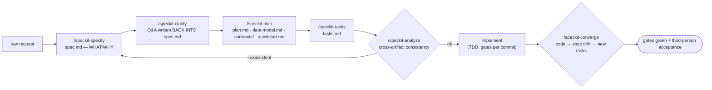

<!-- WHO READS ME: an AI running a feature end-to-end — 4th in the reading order.
     I POINT TO: ../gates/GATES.md (the floor) · ../harness/agents/ (who does what)
     · RETROFIT-PLAYBOOK.md (brownfield variant) · ../examples/todo-api/ (worked example). -->

# The Level-1 Spec Flow

Built on [GitHub Spec Kit](https://github.com/github/spec-kit) v1.x commands (`/speckit-*`).
Install: `uv tool install specify-cli && specify init --here --integration <agent>`. Spec Kit
numbers a directory under `specs/` — it does **not** create git branches (verified against the
CLI source), so it coexists with trunk-based/main-only repos.



## The steps, with the rules that make them work

1. **specify** — WHAT/WHY only. User stories are prioritized (P1/P2/P3) and each must be
   *independently testable* (a P1 alone is a viable MVP). Success criteria are measurable and
   technology-agnostic. No implementation detail lives here.
2. **clarify** — questions and answers are written **back into `spec.md`** (a `Clarifications`
   section with dates). Never a separate file: two sources for one contract is the
   telephone-game bug.
3. **plan** — HOW: `plan.md`, plus `data-model.md` (entities/schema deltas), `contracts/`
   (API/event contracts for this feature), and **`quickstart.md`** — the runnable acceptance
   script. Quickstart is not documentation garnish; it is what
   [`tester-e2e`](../harness/agents/tester-e2e.md) executes and what a
   *vacuous-green* check runs against (a test filter that matches zero tests exits 0 — always
   verify your `-run` patterns match real test names).
4. **tasks** — small, dependency-ordered, each verifiable. This is where legacy "slices/tickets"
   live now ([`LEVELS.md`](LEVELS.md) mapping table).
5. **analyze** — the cross-artifact consistency gate: spec ↔ plan ↔ tasks ↔ constitution. It
   *generates nothing*; it catches contradictions. Run it before implementing anything large.
6. **implement** — TDD (red → green), the [gate chain](../gates/GATES.md) on every commit,
   dispatched via [`task-orchestra`](../harness/agents/task-orchestra.md) when parallelizable
   (file-disjoint workers only; the orchestrator owns the merge).
7. **converge** — the brownfield heartbeat: compare the codebase against spec/plan/tasks; the
   difference becomes **new tasks**, not silent drift. Run when you suspect the spec lies.

## Two invariants of the flow

- **HARD-GATE**: no implementation before the human approves the spec. The pipeline pauses
  there by design (Spec Kit's own workflow.yml encodes this as an approve/reject gate).
- **Spec = the feature's Technical Document.** One source. When code and spec diverge, fix the
  spec *with the correction marked* (a `(≠old)` tag and a dated Clarifications entry) so
  readers see that reality moved — see [`RETROFIT-PLAYBOOK.md`](RETROFIT-PLAYBOOK.md) §"verify,
  don't transcribe".

## Frontmatter convention (kit extension, keeps roadmap views cheap)

```yaml
# specs/012-payment-qr/spec.md — first lines
feature: 012-payment-qr
status: draft | approved | shipped | superseded
epic: payments          # label only — the atom is still this directory
```
