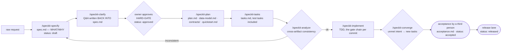

<!-- WHO READS ME: an AI running a feature end-to-end — 4th in the reading order.
     I POINT TO: ../gates/GATES.md (the floor) · ../harness/agents/ (who does what) ·
     ../speckit/README.md (the kit's Spec Kit template overrides) · PHASE-0.md (feature 001) ·
     NON-FEATURE-WORK.md (work that is not a feature) · ARCHETYPES.md (per kind of product)
     · RETROFIT-PLAYBOOK.md (brownfield variant) · ../examples/ (worked examples). -->

# The Level-1 Spec Flow

Built on [GitHub Spec Kit](https://github.com/github/spec-kit). Everything this file says about
Spec Kit was checked against **specify-cli 1.0.12**, the version kit 1.4.0 was tested with;
install that version (`uv tool install specify-cli==1.0.12`, then
`specify init --here --force --non-interactive --integration claude` — the full order is in
[PHASE-0](PHASE-0.md) §2). Commands are written in Claude Code's form, `/speckit-<name>`; other
hosts spell them differently ([HARNESS §7](../harness/HARNESS.md)).

Spec Kit numbers a directory under `specs/` and does **not** create a git branch: in 1.0.12,
`/speckit-specify` creates the spec directory itself, and a branch appears only if the optional
`git` extension's `before_specify` hook is installed. So it coexists with trunk-based and
main-only repositories.


```mermaid
flowchart LR
    RAW[raw request] --> SP["/speckit-specify<br/>spec.md — WHAT/WHY<br/>status: draft"]
    SP --> CL["/speckit-clarify<br/>Q&A written BACK INTO spec.md"]
    CL --> AP{"owner approves<br/>HARD-GATE<br/>status: approved"}
    AP --> PL["/speckit-plan<br/>plan.md · data-model.md · contracts/ · quickstart.md"]
    PL --> TK["/speckit-tasks<br/>tasks.md, test tasks included"]
    TK --> AZ{"/speckit-analyze<br/>cross-artifact consistency"}
    AZ -->|inconsistent| SP
    AZ -->|ok| IM["/speckit-implement<br/>TDD, the gate chain per commit"]
    IM --> CV{"/speckit-converge<br/>unmet intent → new tasks"}
    CV --> AC(["acceptance by a third person<br/>acceptance.md · status: accepted"])
    AC --> RL(["release lane<br/>status: released"])
```

## Command reference (what each command writes, and when)

| Command | Writes | When to run | Note |
|---|---|---|---|
| `/speckit-constitution` | `.specify/memory/constitution.md` | amendments | at adoption `adopt.py` seeds the file from the kit's template and Phase 0 fills it ([PHASE-0](PHASE-0.md) §6); with the kit's override installed, this command keeps the kit's seven articles |
| `/speckit-specify <desc>` | `specs/<id>/spec.md` | every new feature | WHAT/WHY only; creates the directory, **no git branch**; the kit's template override starts the file with the frontmatter |
| `/speckit-clarify` | Q&A **back into** `spec.md` | when the spec has holes, before approval | up to 5 questions; answers under `## Clarifications` → `### Session YYYY-MM-DD` |
| `/speckit-plan` | `plan.md` · `research.md` · `data-model.md` · `contracts/` · `quickstart.md` | after spec approval | quickstart = the acceptance script; kit rule: Technical Context points to Platform Constraints (step 4) |
| `/speckit-tasks` | `tasks.md` | after plan | Spec Kit makes tests optional; the kit's override makes them required (Article VI) |
| `/speckit-analyze` | nothing — a report | before implementing anything that is not small | read-only; a constitution conflict is CRITICAL |
| `/speckit-implement` | code | after analyze is clean | TDD + [gate chain](../gates/GATES.md) per commit; it checks checklists, **not** approval |
| `/speckit-converge` | appends a `## Phase N: Convergence` to `tasks.md` | after implement, when code may not match intent | never edits `spec.md` or `plan.md` |
| `/speckit-checklist` | a checklist under `checklists/` | optional, after plan | requirement quality, not implementation progress |
| `/speckit-taskstoissues` | GitHub issues | optional | only with a GitHub remote and the GitHub MCP server |

Roles from [`../harness/agents/`](../harness/agents/) plug in around these:
`requirement-researcher` feeds `specify`; `task-orchestra` runs `implement`; `tester-e2e`
executes `quickstart.md`; `tech-lead-review` blocks the commit. Skills in
[`../harness/skills/`](../harness/skills/) — spec-first (to approval), plan-and-tdd (from
approval to landed commits), careful, caveman, ponytail — shape how each step is done.

### The kit's template overrides

Spec Kit 1.0.12 resolves each template from `.specify/templates/overrides/` before its own
(`specify preset resolve spec-template` names the layer it used; with an override in place it
printed `top layer from: project override`). `adopt.py` installs the kit's overrides there
([`../speckit/README.md`](../speckit/README.md)):

- **spec** — the frontmatter below at line 1, and no second `**Status**:` line in the body.
  Without it, Spec Kit's own template produced specs with no frontmatter at all, and the
  roadmap view printed nothing (measured in the 2026-09 audit).
- **tasks** — test tasks required, in Spec Kit's `- [ ] T001 …` checklist format, which the
  gates parse.
- **constitution** — the kit's template, so `/speckit-constitution` amends against the kit's
  seven articles instead of reshaping the file into Spec Kit's five-principle scaffold.

A project that removes an override gets Spec Kit's default back for that template, and Spec
Kit says nothing; `adopt.py --check` reports the file as installed, now missing.

## Spec frontmatter — the record the gates read

Real YAML, at line 1 of `specs/<id>/spec.md`. Nothing may precede the opening `---`: not a
comment, not a blank line, not a code fence (the pre-1.4.0 worked example put it in a
```` ```yaml ```` fence, which the gates now report as red).

```yaml
---
feature: 012-payment-qr      # equals the directory name
status: approved             # draft | approved | accepted | released | superseded
epic: payments               # a label; the roadmap groups by it
owner: Lan                   # who drives the spec (recommended)
approved_by: Lan             # required once status is not draft
approved_on: 2026-09-30      # required once status is not draft (YYYY-MM-DD)
---
```

Required: `feature`, `status`, `epic`; plus `approved_by` and `approved_on` whenever status is
not `draft`. A superseded spec adds `superseded_by: <id>`, naming an existing spec directory.
The legacy status `shipped` is read as `accepted`. The template's placeholders
(`feature: "[###-feature-name]"`, `epic: "[EPIC]"`) are red in `doc-sync` until filled.

Tasks in `tasks.md` use Spec Kit's checklist format, `- [ ] T001 …` and `- [x] T001 …` (`[X]`
counts as ticked). A task moved out of the feature stays listed, unticked, with
`(deferred → <spec id or issue>)` on its line; the gates do not count it as open.

| Status | Means | Moved by | Checked by |
|---|---|---|---|
| `draft` | being written; no task may be ticked | the author | `spec-approval`: a ticked task on a draft spec is red |
| `approved` | the owner said yes; implementation may start (the HARD-GATE) | the owner, with `approved_by` and `approved_on` | `spec-approval`: both fields present and dated |
| `accepted` | every task done or deferred, the chain green, and someone other than the builder ran `quickstart.md` | the acceptor, with `acceptance.md` | `doc-sync`: no open task; `spec-approval`: a valid `acceptance.md` |
| `released` | reached its users through the [release lane](NON-FEATURE-WORK.md#release) | whoever performed the release | `spec-approval`, as for `accepted` |
| `superseded` | replaced by `superseded_by` | the author of the replacement | — |

The acceptance record, `specs/<id>/acceptance.md`, is defined in
[GATES §3](../gates/GATES.md): who ran it, as whom, when, and `result: pass`.

### The roadmap is a view

There is deliberately no `roadmap.md` to hand-maintain. The roadmap is printed from the
frontmatter, so it cannot drift from the work:

```bash
sh <<'EOF'
for f in specs/*/spec.md; do
  [ -f "$f" ] || continue
  awk -v dir="$(basename "$(dirname "$f")")" '
    { sub(/\r$/, "") }
    NR == 1 { if ($0 != "---") exit; next }
    $0 == "---" { exit }
    /^[A-Za-z_][A-Za-z0-9_-]*[ \t]*:/ {
      k = $0; sub(/[ \t]*:.*$/, "", k)
      v = $0; sub(/^[^:]*:[ \t]*/, "", v); sub(/[ \t]+#.*$/, "", v); sub(/[ \t]+$/, "", v)
      m[k] = v
    }
    function get(k) { return (k in m) && m[k] != "" ? m[k] : "?" }
    END { print get("epic") "\t" dir "\t" get("status") "\t" get("owner") }' "$f"
done | sort
EOF
```

One line per spec — epic, directory, status, owner — sorted by epic, then by number. A key that
is missing prints `?`, and a spec whose frontmatter is not at line 1 prints `?` in every column,
so it shows up instead of vanishing. (The one-liner this replaces, `grep … | paste - - -`,
silently dropped specs without the keys and shifted every later row by one when a single key
was missing.) Checked with dash and bash, on a corpus with a complete spec, a missing `epic`, a
fenced pre-1.4.0 frontmatter, CRLF line endings and a timestamp-numbered directory. A directory
with no `spec.md` is not listed; `spec-approval` reports it.

## The steps, with the rules that make them work

1. **specify** — WHAT/WHY only. User stories are prioritized (P1/P2/P3) and each must be
   *independently testable* (a P1 alone is a viable MVP). Success criteria are measurable and
   technology-agnostic. No implementation detail lives here. `/speckit-specify` keeps at most
   three `[NEEDS CLARIFICATION]` markers and makes informed guesses for the rest; a question
   that matters more than its guess goes to the owner or to clarify, not into a silent
   assumption.
2. **clarify** — questions and answers are written **back into `spec.md`**. Never a separate
   file: two sources for one contract is the telephone-game bug.
3. **approve — the HARD-GATE.** The owner reads the spec and says yes; the frontmatter gets
   `status: approved`, `approved_by`, `approved_on`, in a commit. See
   [below](#the-hard-gate-what-actually-pauses) for what enforces it.
4. **plan** — HOW: `plan.md`, plus `data-model.md` (entities and schema deltas),
   `contracts/` (interfaces this feature adds), and **`quickstart.md`** — the runnable
   acceptance script. Quickstart is not documentation garnish; it is what
   [`tester-e2e`](../harness/agents/tester-e2e.md) executes, through the product's real entry
   point (constitution Article V). Technical Context points to the constitution's Platform
   Constraints and adds only what this feature adds; a stack that differs is a constitution
   amendment in the same change, or a plan error. Anything the feature must do to reach users
   goes in a `## Release` section ([release lane](NON-FEATURE-WORK.md#release)).
5. **tasks** — small, dependency-ordered, each verifiable, test tasks before the code they
   prove. This is where legacy "slices" and "tickets" live now ([LEVELS](LEVELS.md)).
6. **analyze** — the cross-artifact consistency gate: spec ↔ plan ↔ tasks ↔ constitution. It
   *generates nothing*; it catches contradictions. Run it before implementing anything that is
   not small ([PHASE-0](PHASE-0.md) §10 says what small means per project size).
7. **implement** — TDD (red → green), the [gate chain](../gates/GATES.md) on every commit,
   each commit carrying `Spec: <id>` ([GATES §10](../gates/GATES.md)); dispatched through
   [`task-orchestra`](../harness/agents/task-orchestra.md) when parallelizable (file-disjoint
   workers only; the orchestrator owns the merge). A task's checkbox is ticked in the commit
   that lands it.
8. **converge** — compare the code against spec, plan and tasks; intent the code does not
   deliver becomes **new tasks** (Spec Kit's converge appends them and never edits the spec).
9. **accept** — someone other than the builder runs `quickstart.md` and writes
   `acceptance.md`; the status becomes `accepted`. Releasing is a separate lane.

**Tests vacuous?** A test filter that matches zero tests exits green under several runners;
the `test` slot guards against it ([ARCHETYPES](ARCHETYPES.md), "Stack stanzas").

## The HARD-GATE: what actually pauses

**No implementation before the owner approves the spec.** Until v1.4.0 this file said the
pipeline pauses there "by design", citing Spec Kit's workflow. That was true only of one way to
run Spec Kit:

- **Under `specify workflow run speckit`**, the bundled workflow in 1.0.12 does pause: its
  steps are specify → `review-spec` (an approve/reject gate) → plan → `review-plan` →
  tasks → implement. That workflow skips clarify, analyze and converge, and this kit does not
  use it.
- **On the per-command path this kit uses** (`/speckit-specify`, `/speckit-plan`, …), nothing
  in Spec Kit pauses. `/speckit-implement` checks checklist boxes, not approval, and no command
  reads a spec's status or changes it (Spec Kit's own template writes `**Status**: Draft` into
  the body once, and nothing looks at it again).

So on the per-command path the pause is two things: the discipline of
[spec-first](../harness/skills/spec-first/SKILL.md), and
[`gates/check-spec-approval.sh`](../gates/check-spec-approval.sh) in the chain — red when a
task is ticked while the spec is `draft`, and red when a spec past `draft` has no
`approved_by` and `approved_on`. The gate proves a dated record exists, not that the owner
really said yes (its BLIND TO block); review and `git blame` on the approval line cover that.

## When code and spec disagree

When code and spec disagree, find out which one moved. If the spec states intended behaviour
the code does not deliver, the code is wrong: record a new task (converge). If the code
reflects a deliberate, owner-approved change the spec never recorded, fix the spec with the
correction marked (≠old) and a dated Clarifications entry. If you cannot tell, ask the owner.

The spec is the feature's technical document — one source. Converge covers the first case
and, by design, never touches the spec. The second case is an edit a person approves, with the
old claim still visible. For a legacy corpus, where the docs are the ones that froze, the same
rule is applied document by document in [RETROFIT-PLAYBOOK](RETROFIT-PLAYBOOK.md) §1.

## Numbering, teams and monorepos

**Sequential numbers collide across branches.** Spec Kit's sequential numbering looks only at
the local `specs/` directory. Measured in the 2026-09 audit: two branches from the same base
each created a spec and both got `002`; after the merge `specs/` held `002-login-page` and
`002-payment-export`, and git reported no conflict. The roadmap sorts by that number and every
tool addresses a feature by it.

- **One branch creating specs at a time** (solo, or specs always created on main): sequential
  `NNN-` is fine.
- **More than one branch creating specs at once**: switch to timestamps. In 1.0.12,
  `/speckit-specify` reads `"feature_numbering"` from `.specify/init-options.json`; set it to
  `"timestamp"` and new directories are named `YYYYMMDD-HHMMSS-<name>`. A later
  `specify init` rewrites the value to `"sequential"` (checked), so set it again after any
  re-init. The helper script takes the same choice per call:
  `.specify/scripts/bash/create-new-feature.sh --timestamp …`.
- Either way, [`gates/check-spec-numbers.sh`](../gates/check-spec-numbers.sh) is red when two
  directories share a prefix — it catches the collision at the merge, or in CI on the merge
  result, not before.

**Who owns a spec.** `owner:` names who drives it; `approved_by:` who said yes. In a team, the
approver is the spec's owner or the person the constitution's Governance names — not the agent
that wrote it, and preferably not the person who will build it. A review requirement on the
default branch (your host's branch protection) makes the approval visible outside the file.

**A monorepo** keeps one kit and one flow:

- **One root.** `factory/`, `.claude/`, `gates/` and `specs/` at the repository root. The
  kit's gates read `./specs`; `/speckit-specify` creates under `specs/`.
- **One constitution for what binds everyone** — Articles II, IV and VI, and Governance.
  Each package's stack goes in its own `platform.md`, listed by the root Platform Constraints
  as that package's owner of the stack; the constitution does not restate it.
- **Per-package `CLAUDE.md`** for that package's commands. Claude Code loads a subdirectory's
  `CLAUDE.md` when it reads files there, or at launch when started there (Claude Code docs,
  read 2026-09-29). Safety invariants stay in the root `.claude/CLAUDE.md`, which always loads.
- **Start sessions at the repository root.** Claude Code reads `.claude/settings.json`, where
  the careful hook is registered, from the session's working directory (same docs): a session
  started in `packages/api/` runs without the guard.
- **Specs per package, one corpus.** `epic:` names the package or team, `owner:` that team's
  spec owner; timestamp numbering, since teams create specs in parallel.
- **The chain runs every package.** Each standard slot calls each package's command, or extra
  slots per package sit beside the standard ones ([ARCHETYPES](ARCHETYPES.md#monorepo--multi-team)).
  Running only the affected packages is your monorepo tool's job, not the kit's.

## Keeping Spec Kit current

The version is pinned in the constitution's Platform Constraints. To move it: read the release
notes for renamed or removed commands, then `uv tool install specify-cli==<version>`, then
`specify integration upgrade claude --force` — upgrading the CLI alone does not refresh the
project's `.claude/skills/speckit-*` or `.specify/` scripts, and without `--force` a dozen of
them stay old — then `python3 factory/bin/adopt.py --check`, and re-run the adoption audit
([AI-ONBOARDING §4](../AI-ONBOARDING.md)). What each step did when run, and why
`specify self upgrade` is not the recommended path, is in
[DAILY-SYNC](../sync/DAILY-SYNC.md) Part B, "Upgrade Spec Kit". The kit's claims about Spec Kit
hold for 1.0.12; for another version, check them.
